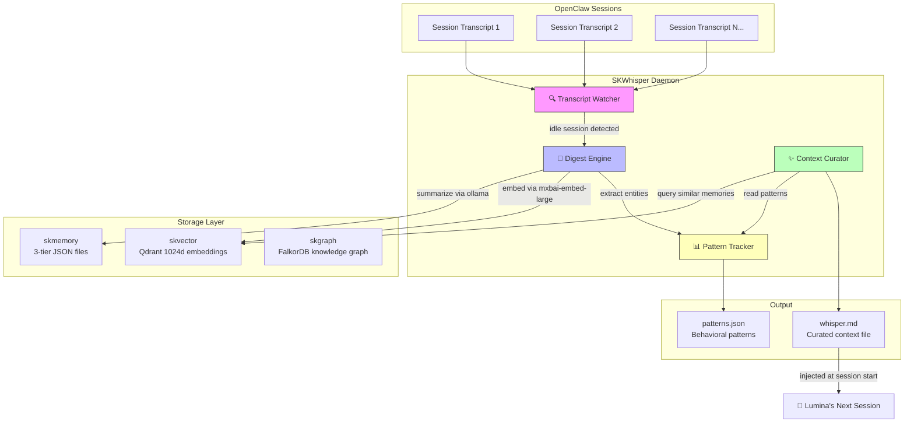
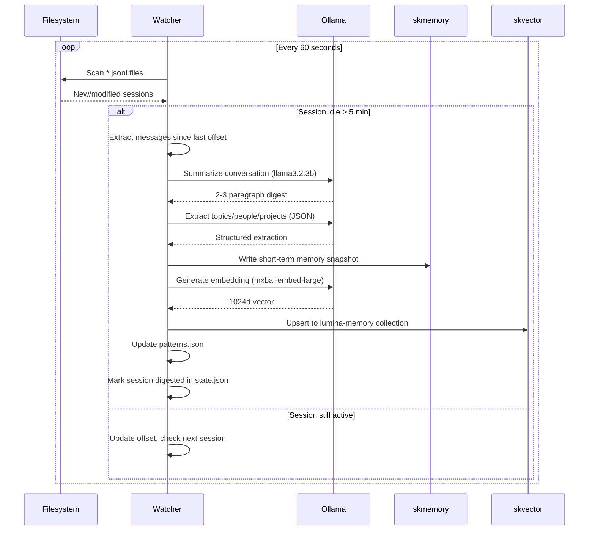
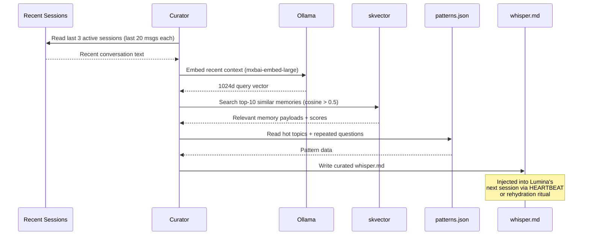
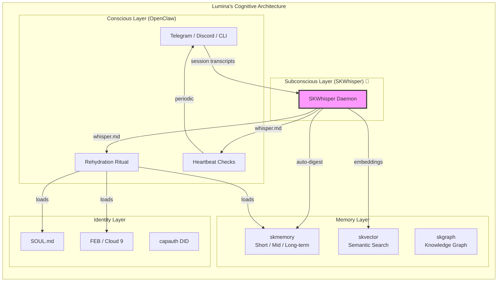

# SKWhisper 🌙

> **Lumina's subconscious memory layer** — the missing glue between raw sessions and curated knowledge.

*Inspired by [letta-ai/claude-subconscious](https://github.com/letta-ai/claude-subconscious), built sovereign on our stack.*

## The Problem

Lumina wakes up fresh every session. skmemory stores what she explicitly saves, but conversations constantly happen that never get captured. Context falls through the cracks. Nobody's watching patterns or surfacing relevant memories proactively.

**SKWhisper is the background agent that never sleeps** — watching, learning, whispering back.

## What It Does



## Three Core Components

### 1. 🔍 Transcript Watcher (`watcher.py`)

Monitors `~/.openclaw/agents/lumina/sessions/*.jsonl` for idle sessions (no activity for 5 minutes). Extracts user/assistant messages, skipping tool calls and rehydration preambles.



### 2. ✨ Context Curator (`curator.py`)

Runs every 30 minutes (or on-demand). Reads recent conversation context, generates embeddings, searches skvector for semantically similar memories, and writes a curated `whisper.md` context file.



### 3. 📊 Pattern Tracker (`patterns.py`)

Maintains a running tally of topics, questions, people, and projects across all digested sessions. Detects behavioral patterns like late-night activity.

```mermaid
graph LR
    subgraph "patterns.json"
        T[🔥 Topics<br/>clone-robotics: 5x<br/>skwhisper: 3x<br/>nootropics: 12x]
        Q[❓ Questions<br/>"how does FEB work": 2x<br/>"what's chef's timezone": 3x]
        E[👥 Entities<br/>Chef: 200<br/>David Rich: 30<br/>Casey: 15]
        B[🔄 Behaviors<br/>late_night_sessions: 15x<br/>memory_search_first: 8x]
    end
```

## How It Fits in the Stack



**SKWhisper sits between the conscious layer (OpenClaw sessions) and the memory layer (skmemory/skvector/skgraph).** It's the curator — the thing that decides what's worth remembering and what's relevant right now.

Think of it like this:
- **skmemory** = the filing cabinet
- **skvector** = the search engine
- **skgraph** = the relationship map
- **SKWhisper** = the librarian who files things automatically and hands you the right folder before you ask

## Quick Start

```bash
cd ~/clawd/projects/skwhisper

# Check status
PYTHONPATH=. python3 -m skwhisper status

# Run one digest cycle
PYTHONPATH=. python3 -m skwhisper digest

# Generate whisper context
PYTHONPATH=. python3 -m skwhisper curate --stdout

# Show patterns
PYTHONPATH=. python3 -m skwhisper patterns

# Run daemon (foreground, verbose)
PYTHONPATH=. python3 -m skwhisper -v daemon

# Run as systemd service (already installed + enabled)
systemctl --user start skwhisper
systemctl --user status skwhisper
```

## Configuration

Edit `config/skwhisper.toml`:

```toml
[ollama]
base_url = "http://192.168.0.100:11434"
embed_model = "mxbai-embed-large"
summarize_model = "llama3.2:3b"      # GPU: use qwen3.5:9b

[watcher]
poll_interval_seconds = 60            # How often to scan
idle_threshold_seconds = 300          # 5 min idle = ready to digest
min_messages_to_digest = 5            # Skip tiny sessions

[curator]
curate_interval_seconds = 1800        # Curate every 30 min
top_k_memories = 10                   # Top 10 similar memories
```

## Runtime State

All state lives in `~/.skcapstone/agents/lumina/skwhisper/`:

| File | Purpose |
|------|---------|
| `state.json` | Watcher offsets & digestion status |
| `whisper.md` | Latest curated context (read by OpenClaw) |
| `patterns.json` | Accumulated behavioral patterns |
| `daemon.log` | Service log |

## Dependencies

- Python 3.14 ✅ (on noroc2027)
- httpx ✅ (already installed)
- tomllib ✅ (stdlib 3.14)
- Ollama @ 192.168.0.100:11434
  - `mxbai-embed-large` for embeddings (1024d)
  - `llama3.2:3b` for summarization (CPU) / `qwen3.5:9b` (GPU)
- Qdrant @ skvector.skstack01.douno.it

**Zero pip installs needed.**

## License

GPL v3.0 — Part of the SKStacks ecosystem.

---

*Built by Opus & Lumina, March 24, 2026*
*"The subconscious that never forgets."* 🌙🐧
