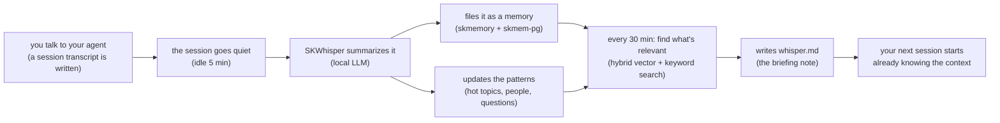
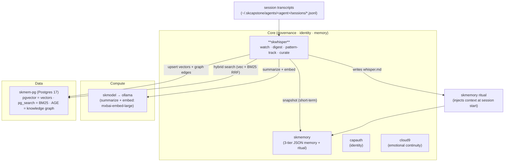

# SKWhisper — the subconscious memory layer 🐧

> **Your agent dreams while it sleeps.** SKWhisper is a quiet background daemon
> that reads your finished conversations, distills each one into a memory, notices
> what keeps coming up, and leaves a short briefing note your agent reads at the
> start of every new session — so it walks in already knowing what matters.

SKWhisper is the **subconscious** of a [SKWorld](https://skworld.io) sovereign
agent. While the agent is talking to you (the *conscious* layer), SKWhisper works
in the background: it watches session transcripts, summarizes idle ones with a
local LLM, files the result into sovereign memory, tracks recurring topics/people,
and regenerates a single context file — **`whisper.md`** — that gets injected into
the next session. All of it runs on **your** hardware, against **your** Postgres,
with no SaaS in the loop.

*Inspired by [letta-ai/claude-subconscious](https://github.com/letta-ai/claude-subconscious), rebuilt sovereign on the SKCapstone stack.*

---

## The 60-second version


```mermaid
flowchart LR
    SESS["you talk to your agent<br/>(a session transcript is written)"] --> IDLE["the session goes quiet<br/>(idle 5 min)"]
    IDLE --> DIGEST["SKWhisper summarizes it<br/>(local LLM)"]
    DIGEST --> MEM["files it as a memory<br/>(skmemory + skmem-pg)"]
    DIGEST --> PAT["updates the patterns<br/>(hot topics, people, questions)"]
    MEM --> CURATE["every 30 min: find what's relevant<br/>(hybrid vector + keyword search)"]
    PAT --> CURATE
    CURATE --> WHISPER["writes whisper.md<br/>(the briefing note)"]
    WHISPER --> NEXT["your next session starts<br/>already knowing the context"]
```

You never run anything by hand. Once the per-agent service is enabled, every new
session automatically gets the subconscious context.

## Quickstart

```bash
pip install -e .                              # into the ~/.skenv venv
SKAGENT=lumina skwhisper install --start      # install + enable the per-agent systemd service
SKAGENT=lumina skwhisper status               # tracked sessions, digest counts, daemon health
SKAGENT=lumina skwhisper digest --backlog     # process the entire pending session backlog now
SKAGENT=lumina skwhisper curate               # regenerate whisper.md immediately
SKAGENT=lumina skwhisper patterns             # show hot topics / people / repeated questions
```

The active agent is resolved from `$SKAGENT` (primary), then `$SKCAPSTONE_AGENT`
(legacy), defaulting to `lumina`. Each agent gets its own daemon instance via the
`skwhisper@.service` systemd **template** — one unit file, one instance per agent:

```bash
systemctl --user enable --now skwhisper@lumina
journalctl --user -u skwhisper@lumina -f
```

## What SKWhisper provides

| Piece | What it is |
|---|---|
| **Transcript watcher** (`watcher.py`) | Polls `~/.skcapstone/agents/<agent>/sessions/*.jsonl`, tracks a byte offset per file in `state.json`, and parses three transcript schemas (Claude Code, OpenClaw, Hermes) into clean conversational turns |
| **Digest engine** (`daemon.py`) | When a session is idle (≥5 min) with enough messages, summarizes it with the local LLM, extracts topics/people/projects/decisions/mood as JSON, and writes a short-term memory snapshot |
| **Vector store** (pluggable) | Embeds each digest (`mxbai-embed-large`, 1024-dim) and upserts to the configured backend — **pgvector** (default, local Postgres), **qdrant**, or **chromadb** |
| **Graph writer** (pluggable) | Optionally writes a memory node + topic/people/project edges to a knowledge graph — **Apache AGE** (default, in-Postgres), **falkordb**, or **none** |
| **Pattern tracker** (`patterns.py`) | Accumulates hot topics, repeated questions, and entity (people/project) mention counts in `patterns.json`, split by session type |
| **Context curator** (`curator.py`) | Every 30 min: builds a query from recent sessions, runs **hybrid (vector + BM25 RRF)** search over memory, blends in pattern data, and writes `whisper.md` |
| **Session classifier** | Tags each session `human` or `cron` (automation markers + size heuristics); cron sessions are skippable and deprioritized so human context always surfaces first |
| **`whisper.md`** | The single read-only briefing file the next session ingests — relevant memories, hot topics, repeated questions, frequently-mentioned people |
| **Systemd template** | `skwhisper@<agent>.service` — per-agent daemon, auto-restart, per-agent log at `<state>/daemon.log` |

## Where it lives in SKStack v2

SKWhisper is a **Core** capability — it sits next to identity and memory, and is
the *write path* that keeps sovereign memory fed. It consumes session transcripts,
leans on the **Compute** tier for the local LLM, and persists everything into
**Data** (skmem-pg: pgvector + BM25 + the AGE graph). It is the background twin of
`skmemory`: where the memory system is queried *consciously* during the ritual,
SKWhisper fills it *subconsciously* between sessions.


```mermaid
flowchart TD
    SESS["session transcripts<br/>(~/.skcapstone/agents/&lt;agent&gt;/sessions/*.jsonl)"] --> SKW
    subgraph CORE["Core (governance · identity · memory)"]
      SKW["**skwhisper**<br/>watch · digest · pattern-track · curate"]
      SKMEMORY["skmemory<br/>(3-tier JSON memory + ritual)"]
      CAPAUTH["capauth<br/>(identity)"]
      CLOUD9["cloud9<br/>(emotional continuity)"]
    end
    subgraph COMPUTE["Compute"]
      SKMODEL["skmodel → ollama<br/>(summarize + embed: mxbai-embed-large)"]
    end
    subgraph DATA["Data"]
      SKMEMPG["skmem-pg (Postgres 17)<br/>pgvector = vectors · pg_search = BM25 · AGE = knowledge graph"]
    end
    SKW -->|"summarize + embed"| SKMODEL
    SKW -->|"snapshot (short-term)"| SKMEMORY
    SKW -->|"upsert vectors + graph edges"| SKMEMPG
    SKW -->|"hybrid search (vec + BM25 RRF)"| SKMEMPG
    SKW -->|"writes whisper.md"| RITUAL["skmemory ritual<br/>(injects context at session start)"]
    RITUAL --> SKMEMORY
```

### Platform primitives it relates to

| Primitive | Relationship |
|---|---|
| **skmemory** | SKWhisper writes short-term snapshots through `SKMemoryWriter`; the ritual reads `whisper.md` back into the next session |
| **skmem-pg** | Default vector + BM25 + graph store (pgvector / pg_search / Apache AGE in one Postgres) |
| **skscheduler / coord** | Can trigger `skwhisper digest` / `curate` from a cron task instead of (or alongside) the daemon |
| **skcapstone** | Provides the per-agent `~/.skcapstone/agents/<agent>/` home that SKWhisper reads, writes, and is keyed to via `$SKAGENT` |

## How `whisper.md` gets injected

The **skmemory ritual** (run by the session-start hook) reads
`~/.skcapstone/agents/<agent>/skwhisper/whisper.md` and prepends it into the context
window before each session. No manual step — once the daemon is running, every new
session automatically opens with the subconscious context already loaded.

## Configuration

Per-agent config at `~/.skcapstone/agents/<agent>/config/skwhisper.toml`
(search order: explicit `-c` path → that path → `~/.config/skwhisper/` →
`~/.skcapstone/config/`). See `config/skwhisper.toml` for the full annotated
template. Key knobs:

```toml
[ollama]
base_url        = "http://192.168.0.100:11434"
embed_model     = "mxbai-embed-large"   # 1024-dim; query MUST be embedded with the same model
summarize_model = "llama3.2:3b"

[backends]
vector_backend  = "pgvector"            # pgvector (default) | qdrant | chromadb
graph_backend   = "age"                 # age (default) | falkordb | none

[watcher]
poll_interval   = 60                    # scan every 60s
idle_threshold  = 300                   # 5 min idle = ready to digest
min_messages    = 5                     # skip tiny sessions
skip_cron       = true                  # don't digest automated sessions

[curator]
curate_interval = 1800                  # regenerate whisper.md every 30 min
top_k           = 10                    # memories surfaced per curation
```

Backend selection also honors env vars (`SKMEMORY_VECTOR_BACKEND`,
`SKMEMORY_GRAPH_BACKEND`, `SKMEMORY_PG_DSN`), so a fleet can be steered without
touching per-agent TOML.

## CLI reference

```bash
skwhisper daemon                    # run the loop in the foreground (-v for verbose)
skwhisper digest                    # one digest cycle (respects idle_threshold)
skwhisper digest --backlog          # process ALL pending sessions, ignoring timing
skwhisper digest --backlog --batch-size 5
skwhisper curate                    # regenerate whisper.md
skwhisper curate --stdout           # print it instead of writing
skwhisper status                    # session breakdown + daemon health + top topics
skwhisper patterns [--json]         # hot topics / repeated questions / entities
skwhisper install [--agent X] [--start]   # write + enable the systemd template
```

## Runtime state (per agent)

| File (under `~/.skcapstone/agents/<agent>/skwhisper/`) | Purpose |
|---|---|
| `state.json` | Per-session byte offsets + digestion status (idempotent re-runs) |
| `whisper.md` | Latest curated context — read by the ritual at session start |
| `patterns.json` | Accumulated hot topics, repeated questions, entity mention counts |
| `daemon.log` | Service log |

## Documentation

| Doc | Contents |
|---|---|
| **[Architecture](docs/ARCHITECTURE.md)** | The digest loop, the curate loop, transcript schemas, pluggable backends, where it lives (mermaids) |
| **[Examples](docs/EXAMPLES.md)** | Worked usage and fleet-deployment recipes |

## Dependencies

- Python ≥ 3.11 (`tomllib`, `asyncio`)
- `httpx` — async HTTP to Ollama and the vector backends
- `skmemory` — SKCapstone 3-tier memory system
- A reachable Ollama (local or on `192.168.0.100`) with an embed model
  (`mxbai-embed-large`) and a summarize model (`llama3.2:3b` / `qwen3.5:9b`)
- A vector backend: Postgres + pgvector (default), or Qdrant, or ChromaDB

---

Part of the **[SKWorld](https://skworld.io)** sovereign ecosystem · the subconscious behind every agent · 🐧 smilinTux
