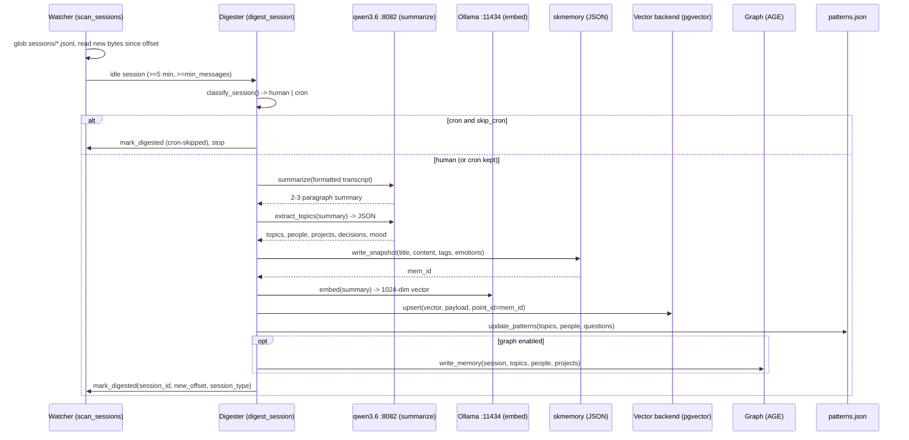
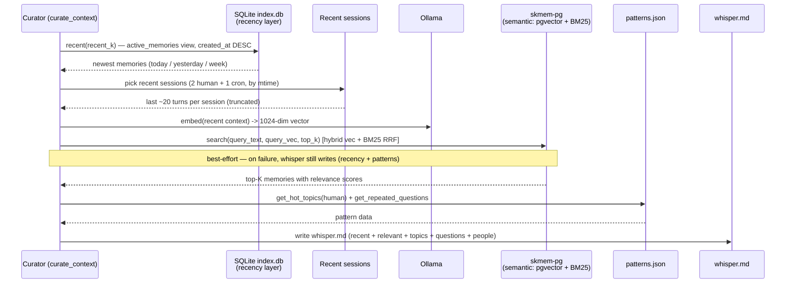
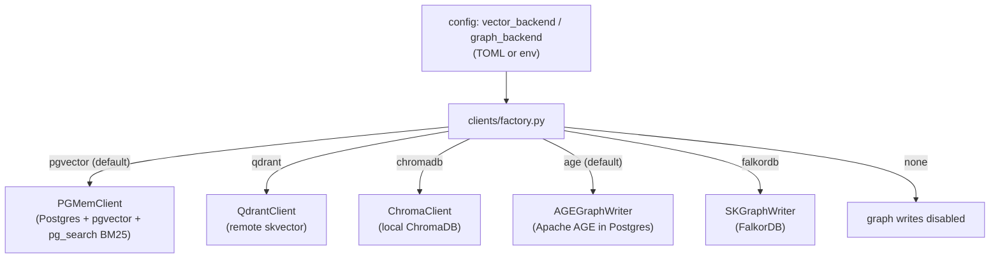
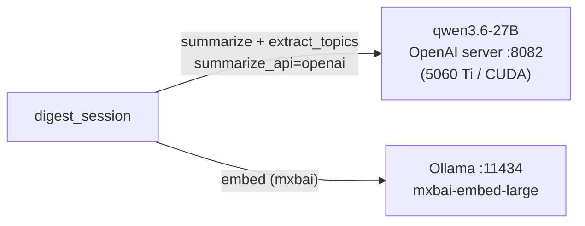
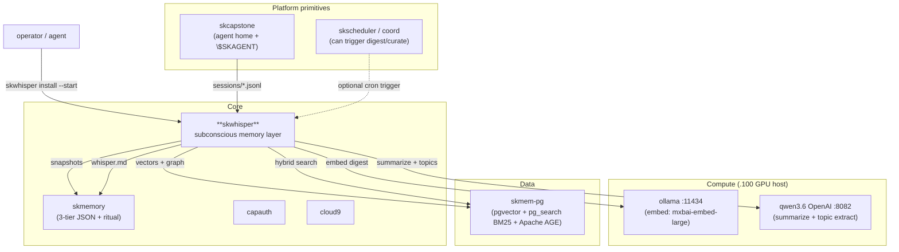

# SKWhisper — Architecture

> The subconscious layer for an agent's memory: digest sessions → surface context →
> detect patterns — all asynchronous, off the conscious critical path, zero latency
> cost to the live conversation.

SKWhisper is a single background Python daemon (`skwhisper daemon`) that runs one
instance **per agent** (keyed to `$SKAGENT`). It has three cooperating concerns —
a **watcher/digester**, a **pattern tracker**, and a **curator** — all sharing a
small set of clients (Ollama, a pluggable vector backend, an optional graph writer,
and the skmemory snapshot writer).

It is the *write side* of sovereign memory. The agent's conscious memory recall (the
skmemory ritual) happens during a session; SKWhisper does the slow, reflective work
**between** sessions: reading what was said, distilling it, and leaving a briefing.

---

## The two loops

The daemon's `run_daemon` loop runs two cadences (see `daemon.py`):

- a **digest cycle** every `poll_interval` (default 60s), and
- a **curate cycle** every `curate_interval` (default 1800s / 30 min).

### Digest loop (per session)



Key properties, all grounded in `daemon.py` / `watcher.py`:

- **Idempotent.** `state.json` records a byte offset and a `digested` flag per
  session id; re-running never re-processes a finished session. Non-digest outcomes
  are recorded too (`skipped-too-few-messages`, `cleaned-missing-file`,
  `cron-skipped`) so `status` can report them.
- **Idle-gated.** `run_digest_cycle` only digests sessions that have gone idle
  (no new bytes for `idle_threshold`). `run_backlog_digest` ignores timing and
  sweeps everything pending in batches — used for first-run catch-up.
- **Safe summaries.** A summary shorter than 20 chars is discarded (the session is
  left pending rather than filed as junk).
- **Dual endpoint (since 2026-06-17).** The two model calls per digest target
  *different* hosts: **summarize** → qwen3.6-27B OpenAI server at
  `http://192.168.0.100:8082/v1/chat/completions`; **embed** → Ollama
  `mxbai-embed-large` at `http://192.168.0.100:11434/api/embed`. See
  [Digest model routing](#digest-model-routing) below for the hardware rationale.

### Curate loop (briefing generation)

The curator blends **two complementary memory feeds** (see *Two memory layers* below):
a **recency** feed (SQLite index — "what just happened") and a **semantic** feed
(skmem-pg hybrid — "what's relevant"). The semantic feed is best-effort: if skmem-pg
is unreachable, whisper.md is still written from recency + patterns.



The curator deliberately **prioritizes human-driven sessions** over cron/automation
when choosing what's "recent" (`_get_recent_context` / `_is_cron_session`), so the
briefing reflects what *you* are working on, not what the scheduler ran.

### Two memory layers (recency + semantic)

whisper draws from two indexes over the same flat-file source of truth, each good at
a different query:

| Layer | Store | Answers | Client |
|---|---|---|---|
| **Recency / relational** | SQLite `index.db` (`active_memories` view) | *"what just happened / latest sessions"* — fast, local, works even if Docker/pg is down | `clients/sqlite_recency.py` |
| **Semantic / graph** | skmem-pg (pgvector + BM25 + AGE) | *"what's relevant across all history"* | `clients/pgmem.py` |

This split is deliberate — it mirrors `skmemory`'s own architecture (the CLI reads the
SQLite index; semantic/graph reasoning uses skmem-pg) and gives whisper resilience: the
recency feed keeps working when the heavy backend doesn't.

---

## Component map

| Source | Responsibility |
|---|---|
| `skwhisper/__main__.py` | CLI: `daemon`, `digest`, `curate`, `patterns`, `status`, `install`; logging setup |
| `skwhisper/daemon.py` | The loop; `digest_session`, `run_digest_cycle`, `run_backlog_digest`, `run_daemon` |
| `skwhisper/watcher.py` | Session scan, multi-schema JSONL parsing, `classify_session`, `state.json` load/save, `mark_digested` |
| `skwhisper/curator.py` | Recent-context gathering, hybrid search, `whisper.md` rendering (`_build_whisper`) |
| `skwhisper/patterns.py` | `patterns.json` accumulation; `get_hot_topics`, `get_repeated_questions` (session-type aware) |
| `skwhisper/config.py` | `$SKAGENT`/`$SKCAPSTONE_AGENT` resolution, TOML merge, config search path, defaults |
| `skwhisper/clients/factory.py` | `make_vector_client` / `make_graph_writer` — backend selection |
| `skwhisper/clients/ollama.py` | Async `embed` (`/api/embed` on `ollama_url`) + `summarize` + `extract_topics` (routed to `summarize_url` via `summarize_api`: OpenAI `:8082` or legacy Ollama `/api/generate`) |
| `skwhisper/clients/pgmem.py` | **Semantic** feed: local Postgres + pgvector + pg_search BM25 hybrid |
| `skwhisper/clients/sqlite_recency.py` | **Recency** feed: read-only accessor for the newest memories in the skmemory SQLite index (`active_memories` view) |
| `skwhisper/clients/qdrant.py` | Alternate vector backend: remote Qdrant / skvector |
| `skwhisper/clients/chroma.py` | Alternate vector backend: local ChromaDB |
| `skwhisper/clients/agegraph.py` | **Default** graph writer: Apache AGE inside the local Postgres |
| `skwhisper/clients/skgraph.py` | Alternate graph writer: FalkorDB / skgraph |
| `skwhisper/clients/skmemory.py` | `SKMemoryWriter` — writes 3-tier JSON snapshots |
| `config/skwhisper.toml` | Annotated per-agent config template |
| `scripts/install.sh` | pip install + systemd template setup |
| `skwhisper@.service` | Systemd template unit (`%i` = agent name) |

---

## Transcript schemas

`extract_messages` (in `watcher.py`) parses three transcript shapes from a single
sessions directory, because different runtimes write the agent home differently:

| Runtime | Line shape |
|---|---|
| **Claude Code** | `type = user \| assistant`, with nested `message.{role, content}` |
| **OpenClaw** | `type = message`, with nested `message.{role, content}` |
| **Hermes** | top-level `role = user \| assistant` + top-level `content` (no `type`, no `message` wrapper); a `role = session_meta` header line is skipped |

Tool calls and tool results are dropped — only conversational turns are kept, which
keeps the LLM summary signal clean.

---

## Pluggable backends

Backend choice is resolved at runtime from config/env by `clients/factory.py`. All
vector clients implement the same async duck-typed interface:

```
embed(text) -> list[float]
search(q_text, q_vec, top_k) -> [{payload, score}]
upsert(vector, payload, point_id)
close()
```



The default path (**pgvector + AGE**) lands every digest into the one local
`skmem-pg` Postgres: vectors via pgvector, keyword matching via pg_search BM25
(fused with vectors through Reciprocal Rank Fusion at curate time), and a knowledge
graph via Apache AGE — no external cluster required. Qdrant/FalkorDB remain selectable
for installs that still front a remote vector/graph cluster.

> **Embedding model contract:** digests are embedded with `mxbai-embed-large`
> (1024-dim). The curator MUST embed its query with the **same** model for the
> vector half of the hybrid search to be meaningful.

---

## Digest model routing

Each digest makes **two** model calls, and (since 2026-06-17) they target two
different endpoints with three dedicated `[ollama]` config keys:

| Call | Endpoint | Driven by |
|---|---|---|
| **Embed** — 1024-dim vector | Ollama `mxbai-embed-large` at `http://192.168.0.100:11434/api/embed` | `ollama_url`, `embed_model` |
| **Summarize** + topic extraction | qwen3.6-27B OpenAI-compatible server at `http://192.168.0.100:8082/v1/chat/completions` | `summarize_url`, `summarize_api`, `summarize_model` |

- **`summarize_url`** = `http://192.168.0.100:8082` — the qwen3.6 OpenAI server.
- **`summarize_api`** = `"openai"` (default) or `"ollama"` (legacy `/api/generate`).
- **`summarize_model`** = `"qwen3.6"`.



**Hardware rationale.** The `.100` host has a single 5060 Ti (16GB CUDA) running
qwen3.6-27B (~13GB), and that is the *only* model that should run on that GPU. A
separate small digest model has nowhere good to live:

- CUDA is already full with qwen3.6.
- The Intel Arc iGPU **corrupts** generated output over Vulkan
  (`GGML_VK_VISIBLE_DEVICES=0` produces garbage — confirmed).
- A CPU-resident model spills and saturates the host.

So digests **reuse the already-loaded qwen3.6** — zero extra VRAM, correct CUDA
output, ~1.5s per short call. This is why `summarize_api` defaults to `"openai"`.
Earlier `summarize_model` values were both wrong and are documented here as a
warning: `llama3.2:3b` was removed from the host (→ a flood of 404s), and the
stop-gap `qwen3.5:4b` spilled to CPU and saturated the box.

> **Optional isolated fallback.** `deploy/ollama-digest.service` defines a CPU-only
> Ollama instance on port `11436` for sites that want a dedicated, isolated digest
> backend. It is currently **disabled** — qwen3.6 reuse is preferred.

---

## SessionEnd hook hardening

The Claude Code `SessionEnd` hook (`hooks/skwhisper-save.sh`) triggers a digest +
re-curate when a session closes. It was hardened (2026-06-17) so a slow or wedged
digest can never hang the closing session:

1. **Single-flight lock** — a per-agent `flock -n` so concurrent session-ends can't
   stack digests on top of each other.
2. **`timeout` caps** — 180s for the digest, 120s for the curate; a stuck backend
   is killed rather than left running.
3. **Detached, no held pipe** — `setsid` plus closed file descriptors so the hook
   detaches and no longer holds Claude Code's stdout pipe open. That pipe-holding
   was the actual cause of sessions **hanging on close**.

Before this, ~47 digests piled up because there was no lock or timeout and they
wedged on a stuck Ollama queue.

---

## Where it lives in the SKWorld ecosystem

SKWhisper is a **Core** capability deployed through skos like every other `sk*`
service. It reads from the agent's filesystem home, calls **Compute** (the local
LLM), and writes into **Data** (skmem-pg). Its sibling is `skmemory`: SKWhisper is
the subconscious *writer*, the ritual is the conscious *reader*.



---

## Design decisions

1. **Polling over inotify** — simpler, survives NFS/Syncthing-backed session dirs,
   no extra dependency. Offsets in `state.json` make it cheap and idempotent.
2. **Local LLM for summarization** — Ollama on the compute node; no transcript ever
   leaves sovereign infrastructure.
3. **Short-term tier on write** — digests land in short-term memory and graduate
   naturally via skmemory's existing promotion, rather than guessing tier on ingest.
4. **File-based briefing** — `whisper.md` is a plain Markdown file any process (the
   ritual, a hook, a human) can read. Dead-simple integration boundary.
5. **Pluggable backends behind one interface** — pgvector/qdrant/chromadb and
   AGE/falkordb/none are swappable without touching the daemon, so the same code runs
   personal (one Postgres) or fleet (remote cluster).
6. **Human-first curation** — cron/automation sessions are classified and
   deprioritized so the subconscious reflects human intent, not scheduler noise.

---

Part of the **[SKWorld](https://skworld.io)** sovereign ecosystem · the subconscious behind every agent · 🐧 smilinTux
